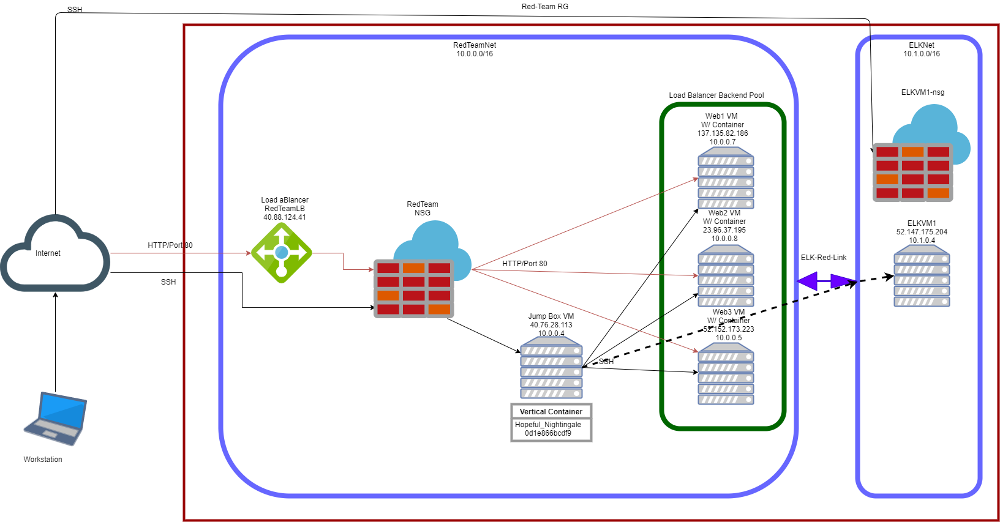
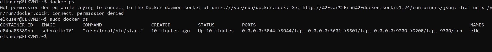

## Automated ELK Stack Deployment

The files in this repository were used to configure the network depicted below.

These files have been tested and used to generate a live ELK deployment on Azure. They can be used to either recreate the entire deployment pictured above. Alternatively, select portions of the playbook file may be used to install only certain pieces of it, such as Filebeat.

  -install-elk.yml

This document contains the following details:
- Description of the Topologu
- Access Policies
- ELK Configuration
  - Beats in Use
  - Machines Being Monitored
- How to Use the Ansible Build

### Description of the Topology

The main purpose of this network is to expose a load-balanced and monitored instance of DVWA, the D*mn Vulnerable Web Application.

Load balancing ensures that the application will be highly available, in addition to restricting access to the network.
- _Load balancers protects the system from Distributed-Denial-of-Service attacks by shifting attack traffic and distributing the traffic over the available resources. The advantage of a jump box is to give access to the user from a single node that can be secured and monitored, it also allows you to simplify inbound rules_

Integrating an ELK server allows users to easily monitor the vulnerable VMs for changes to the log files and system metrics.
- _What does Filebeat watch for? Log files_
- _What does Metricbeat record? Performance Metrics_

The configuration details of each machine may be found below.
_Note: Use the [Markdown Table Generator](http://www.tablesgenerator.com/markdown_tables) to add/remove values from the table_.

| Name     | Function | IP Address | Operating System |
|----------|----------|------------|------------------|
| Jump Box | Gateway  | 10.0.0.4   | Linux            |
| Web1     |Webservers| 10.0.0.6   | Linux            |
| Web2     |Webservers| 10.0.0.7   | Linux            |            
| Web3     |Webservers| 10.0.0.5   | Linux            |
| ELKVM1   |Monitoring| 10.1.0.4   | Linux            |

### Access Policies

The machines on the internal network are not exposed to the public Internet. 

Only the Jump Box Provisioner machine can accept connections from the Internet. Access to this machine is only allowed from the following IP addresses:
- _My IPv4_

Machines within the network can only be accessed by ssh/Port 22.
- _Jump Box Provisioner:  Private IP 10.0.0.4_

A summary of the access policies in place can be found in the table below.

| Name      | Publicly Accessible | Allowed IP addresses              |
|-----------|---------------------|-----------------------------------|
| Jump-box  | Yes                 | My IPv4                           |
| Web1      | No                  | 10.0.0.4                          |
| Web2      | No                  | 10.0.0.4                          |
| Web3      | No                  | 10.0.0.4                          |
| ELKVM1    | Yes                 | My IPv4 (P.5601), 10.0.0.4 (P.22) |

### Elk Configuration

Ansible was used to automate configuration of the ELK machine. No configuration was performed manually, which is advantageous because it saves resources such as time and manpower.
- _What is the main advantage of automating configuration with Ansible? The main advantage of automating configuration with Ansible is that it automates repetitive work and provides consistency while allowing IT admins to focus on more complex work_

The playbook implements the following tasks:
- _Install docker.io, python3.pip and docker module_
- _Increase Virtual memory_
- _Use more memory_
- _Download and Launch a docker elk container
- _Enable docker on boot_

The following screenshot displays the result of running `docker ps` after successfully configuring the ELK instance.

	

### Target Machines & Beats
This ELK server is configured to monitor the following machines:
- _Web1 10.0.0.6_
- _Web2 10.0.0.7_
- _Web3 10.0.0.5_

We have installed the following Beats on these machines:
- _Filebeat_
- _Metricbeat_

These Beats allow us to collect the following information from each machine:
- _Filebeat monitors the log files or locations that you specify, collects log events, and forwards them either to Elasticsearch or Logstash for indexing_
- _Metricbeat periodically collects metrics from the operating system and from services running on the server_

### Using the Playbook
In order to use the playbook, you will need to have an Ansible control node already configured. Assuming you have such a control node provisioned: 

SSH into the control node and follow the steps below:
- _Copy the filebeat-playbook.yml and metricbeat-playbook.yml file to /etc/ansible/roles_
- _Update the /etc/ansible/hosts file to include
- _[webservers]
- _10.0.0.8 ansible_python_interpreter=/usr/bin/python3_
- _10.0.0.7 ansible_python_interpreter=/usr/bin/python3_
- _10.0.0.5 ansible_python_interpreter=/usr/bin/python3_

- _[elk]
- _10.1.0.4 ansible_python_interpreter=/usr/bin/python3_

- Run the playbook, and navigate to http://52.147.175.204:5601/app/kibana to check that the installation worked as expected.

Answer the following questions to fill in the blanks:_
- _Which file is the playbook? Where do you copy it? Install-elk.yml , it is in the docker container in /etc/ansible_
- _Which file do you update to make Ansible run the playbook on a specific machine? /etc/ansible/hosts _
- _How do I specify which machine to install the ELK server on versus which to install Filebeat on? they are separated on the /etc/ansible/hosts under [webservers] and [elk]_
- _Which URL do you navigate to in order to check that the ELK server is running? http://52.147.175.204:5601/app/kibana

_As a **Bonus**, provide the specific commands the user will need to run to download the playbook, update the files, etc._
	
	ansible-playbook /etc/ansible/install-elk.yml
	

